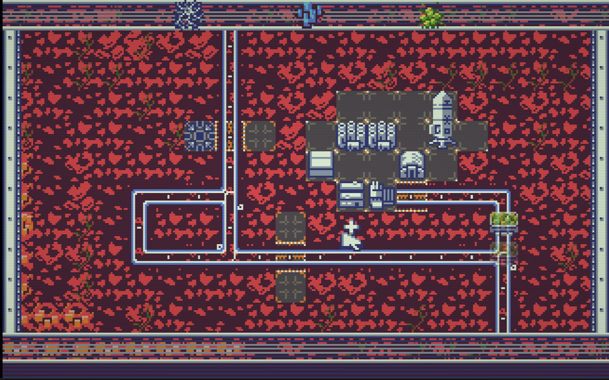

# 

Real-time strategy for x86 processors made in assembly.

# PLAY

[WEB DOS EMULATOR](https://smol.p1x.in/assembly/game12/game12.html)




## Features
* VGA 320x200, 16 colors (DawnBringer palette), 256-color mode
* 2D tile-based, top-down view
* Full keyboard and mouse support
* 16x16 sprites/tiles (2-bit palette compression, 4 colors + transparency)
* Procedural map generation (weighted adjacency rules)
* 128x128 tile map with viewport scrolling
* Double-buffered framebuffer with partial terrain redraw
* RLE image compression for pre-rendered backgrounds
* Sound effects via PC Speaker (IRQ-driven PIT playback)
* Rail system with automatic track orientation and switch logic
* Pod (cart) entity system: moving goods on rails, collision handling
* Base expansion and building placement
* 8 building types: silos, collector, extractor, refinery, lab, radar, pod factory, power
* 3 resource types (white, blue, green): extraction, transport, refinement
* Extractor setup with targeting and resource type selection
* Fog of war with radar visibility expansion
* Radar minimap (satellite view)
* UPX-compressed COM output for DOS
* Bootable FAT12 floppy image (bare-metal + DOS)
* Development tools (vibe coded C):
  * png2asm - convert PNG tilemap to 2-bit paletted assembly
  * rleimg2asm - convert images to RLE-compressed assembly
  * fnt2asm - convert font charset to 1-bit assembly
* All game graphics were made with my own tool: **P1Xel Tool**
  * Source code: https://github.com/w84death/p1xel-tool
  * Binary included in this repo: `tools/p1xel_tool`

## Tileset


## Running
Boot from a floppy or run from MS-DOS (FreeDOS). Floppy image has game file (game.com), instruction, and bootloader for bare-metal run.


## Building
Uses Zig build system (`build.zig`) with FASM assembler.

Build bootable floppy image (default):
```
zig build
```

Build compressed COM file with UPX:
```
zig build com
```

Build uncompressed COM file:
```
zig build com-raw
```

Run in QEMU:
```
zig build qemu
```

Run in Bochs:
```
zig build bochs
```

Build jsdos archive:
```
zig build jsdos
```

Display project statistics:
```
zig build stats
```

Show all available targets:
```
zig build help
```

## Tools

### png2asm
For converting .png tilemap into 2-bit compressed and palettes assembly code.
```./png2asm tileset.png palettes.png ../../src/tiles.asm```

### rleimg2asm
For converting .png image into RLE compressed assembly code.
```./rleimg2asm frames/p1x.png ../../src/img_p1x.asm -asm p1x_logo_image -stats```
### fnt2asm
For converting .png font charset into 1-bit compressed assembly code.
```./fnt2asm font.png ../../src/font.asm```


