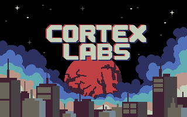
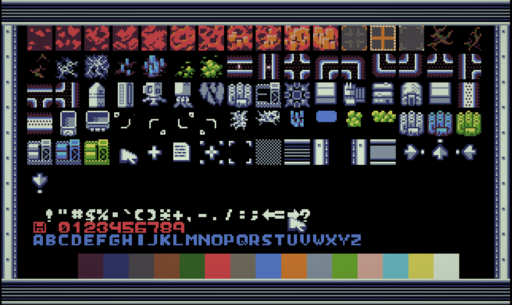
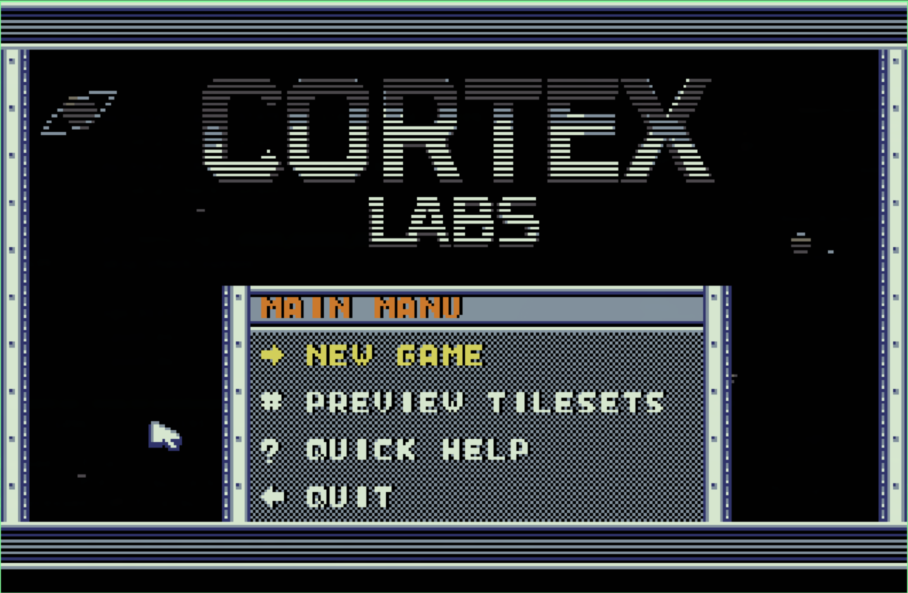
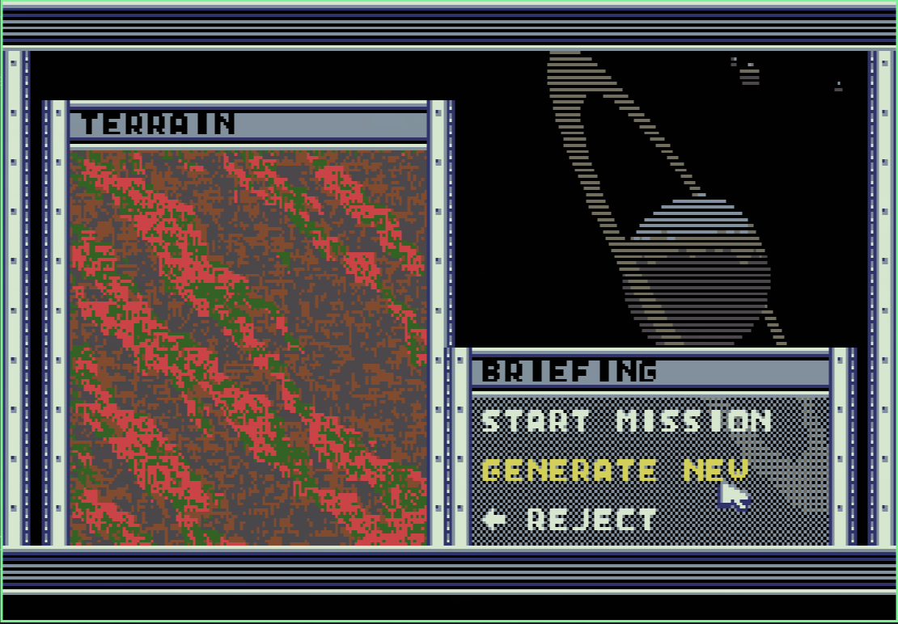
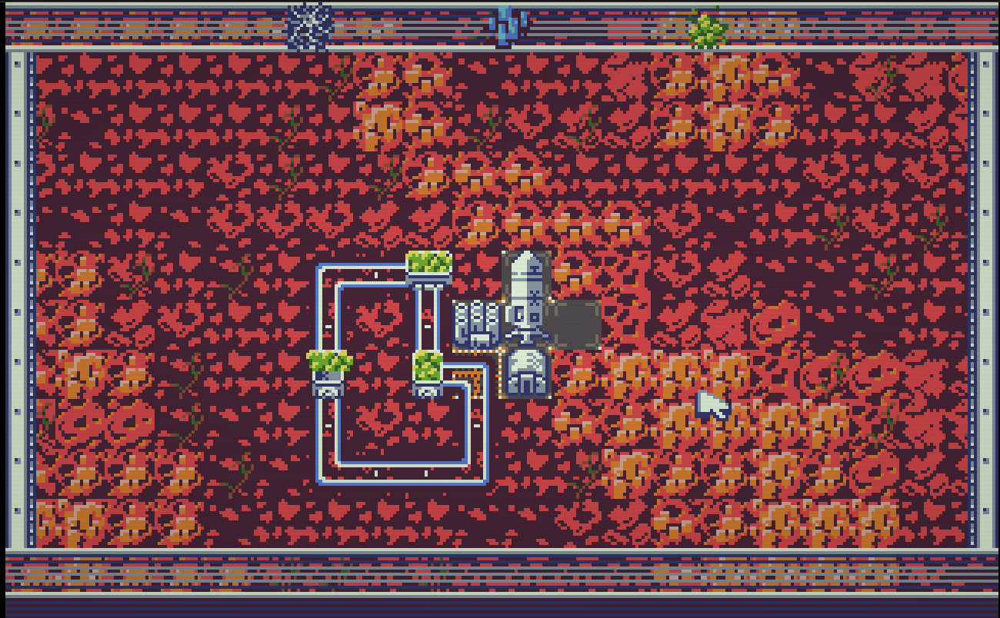
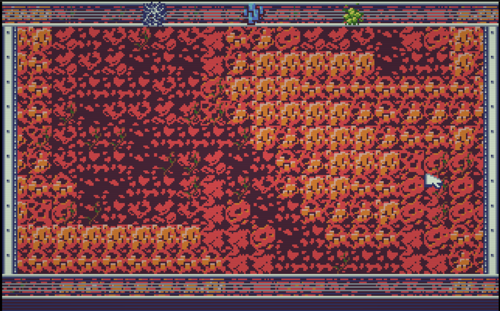

# 

Real-time strategy for x86 processors made in assembly.

# Latest build

* PLAY HERE IN [WEB DOS EMULATOR](https://smol.p1x.in/assembly/game12/game12.html)

# The Game



Cortex Labs is a strategic resource management game set on the hostile planet Kepler-486i, where you command robotic expeditions to harvest Neurofung - a revolutionary organism that can enhance human cognition and extend life by centuries. Operating from a safe orbital distance, you'll build an automated rail network to extract and transport three vital resources across a challenging 128x128 tile map.

Deploy cargo pods on your expanding railway system, strategically placing switches at junctions to optimize routes between extractors and your main base. Establish stations with specialized buildings - factories to refine resources, laboratories to unlock new technologies. Balance the collection of crystals for construction, veins for fuel, and the precious Neurofung mushrooms that must be carefully managed to avoid depletion.

## Story

The year is 2147.
Earth’s last unaging generation is dying.For three decades the greatest minds of Cortex Labs have chased a single impossible dream: Neurofung — the wild mushroom that grows only in the sulfur vents of Kepler-486i. A single gram extends human cognition and cellular lifespan by centuries. A kilogram could rewrite the future of our species.

You are Orbital Commander, voice and mind of the automated expedition. Your body remains safe in the Lagrange habitat above Earth. Your will travels 1,400 light-seconds to the hostile surface of Kepler-486i.

The planet has already claimed two previous missions. Its thin, toxic atmosphere, violent dust cyclones, and shifting tectonic plates make every landing a gamble. But the next planetary alignment — the only flight window for the return rocket — opens in exactly 87 Earth days. After that, the next opportunity is 14 years away.

Touch down the Vanguard Base Module at the pre-scouted equatorial ridge.  
Deploy the first wave of autonomous rail drones and begin construction of a self-expanding 128-by-128 tile transport network.  


## Resources

* *Aetherweave* - delicate, glowing white root-like veins that spread through the upper layers of Kepler-486i’s crust. These organic-mineral hybrids constantly release volatile methane-rich gases. 

* *Cryonite* - dense, metallic-blue crystal rock formations embedded in the planet’s ancient basalt plates. Cryonite is incredibly hard yet surprisingly workable once fractured. It serves as the primary structural material for rail tracks, factories, extractors, and base expansions. 

* *Neurofung* — the most precious biomass in the known galaxy. Harvest carefully. Over-extraction collapses the fungal network for decades. Under-extraction dooms Earth.


## Features
* VGA 320x200, 16 colors (DawnBringer palette), 256-color mode
* 2D tile-based, top-down view
* Full keyboard and mouse support
* 16x16 sprites/tiles (2-bit palette compression, 4 colors + transparency)
* Procedural map generation (weighted adjacency rules)
* 128x128 tile map with viewport scrolling
* Double-buffered framebuffer with partial terrain redraw
* RLE image compression for pre-rendered backgrounds
* Sound effects via PC Speaker (IRQ-driven PIT playback)
* Rail system with automatic track orientation and switch logic
* Pod (cart) entity system: moving goods on rails, collision handling
* Base expansion and building placement
* 8 building types: silos, collector, extractor, refinery, lab, radar, pod factory, power
* 3 resource types (white, blue, green): extraction, transport, refinement
* Extractor setup with targeting and resource type selection
* Fog of war with radar visibility expansion
* Radar minimap (satellite view)
* UPX-compressed COM output for DOS
* Bootable FAT12 floppy image (bare-metal + DOS)
* Development tools (vibe coded C):
  * png2asm - convert PNG tilemap to 2-bit paletted assembly
  * rleimg2asm - convert images to RLE-compressed assembly
  * fnt2asm - convert font charset to 1-bit assembly
* All game graphics were made with my own tool: **P1Xel Tool**
  * Source code: https://github.com/w84death/p1xel-tool
  * Binary included in this repo: `tools/p1xel_tool`

## Tileset


## Running
Boot from a floppy or run from MS-DOS (FreeDOS). Floppy image has game file (game.com), instruction, and bootloader for bare-metal run.






## Building
Uses Zig build system (`build.zig`) with FASM assembler.

Build bootable floppy image (default):
```
zig build
```

Build compressed COM file with UPX:
```
zig build com
```

Build uncompressed COM file:
```
zig build com-raw
```

Run in QEMU:
```
zig build qemu
```

Run in Bochs:
```
zig build bochs
```

Build jsdos archive:
```
zig build jsdos
```

Display project statistics:
```
zig build stats
```

Show all available targets:
```
zig build help
```

## Tools

### png2asm
For converting .png tilemap into 2-bit compressed and palettes assembly code.
```./png2asm tileset.png palettes.png ../../src/tiles.asm```

### rleimg2asm
For converting .png image into RLE compressed assembly code.
```./rleimg2asm frames/p1x.png ../../src/img_p1x.asm -asm p1x_logo_image -stats```
### fnt2asm
For converting .png font charset into 1-bit compressed assembly code.
```./fnt2asm font.png ../../src/font.asm```


